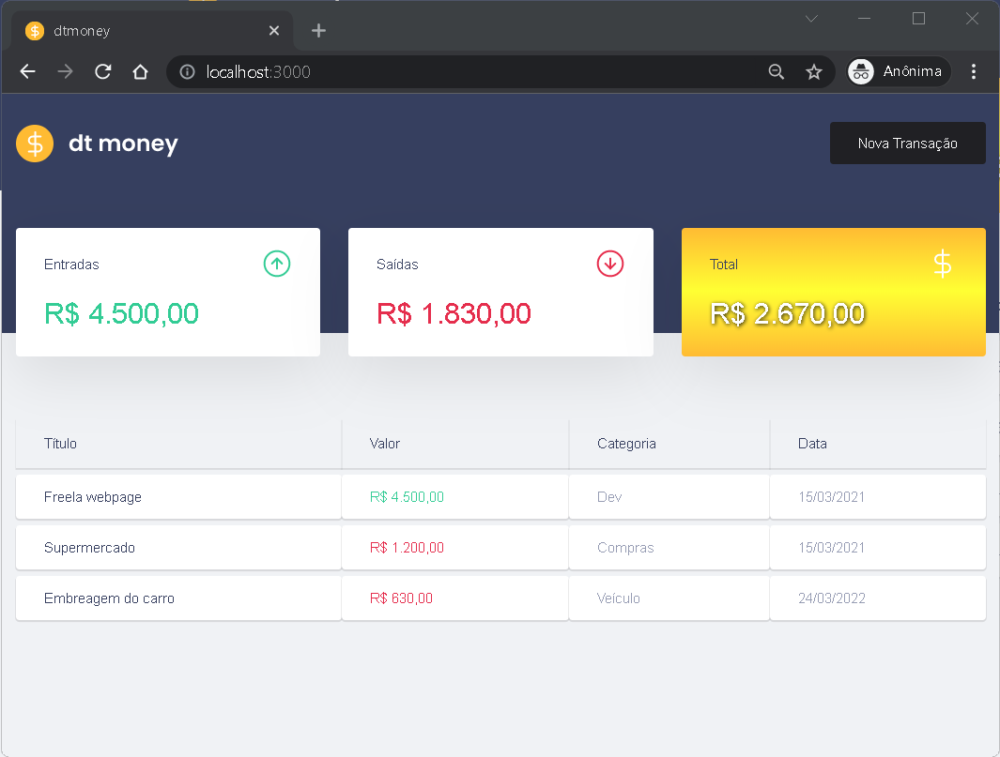

# Sistema Financeiro - DT MONEY

Trata-se de um sistema financeiro simples que permite ao usuário lançar transações diárias e obter o saldo de sua conta. O sistema foi construido com fins didáticos, porém encontra-se totalmente funcional e pode ser aproveitado para a construção de uma ferramenta últil.
<br>



## Techs and Resources

- [React](https://reactjs.org/)
- [TypeScript](https://www.typescriptlang.org/)
- [Axios](https://github.com/axios/axios)
- [MirageJS](https://miragejs.com/)
- [Styled Components](https://styled-components.com/)
- [Polished](https://polished.js.org/)
- [Hooks](https://reactjs.org/docs/hooks-reference.html)
- [States](https://reactjs.org/docs/hooks-reference.html)
- [Constext API](https://reactjs.org/docs/context.html)

<br>

## Installation

```bash
# Abra um terminal e copie este repositório com o comando
git clone https://github.com/esbnet/dtmoney.git
# ou use a opção de download.

# Entre na pasta web com 
cd dtmoney

# Instale as dependências
yarn install

# Rode a aplicação
yarn start
```

<br>


## License

<a href="https://opensource.org/licenses/MIT">
    
</a>

<br>

Esse projeto está sob a licença MIT. Veja o arquivo [LICENSE](/LICENSE) para mais detalhes.
